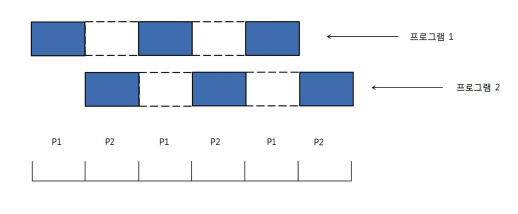
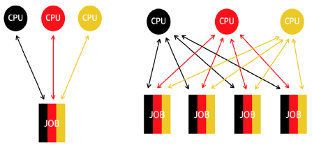
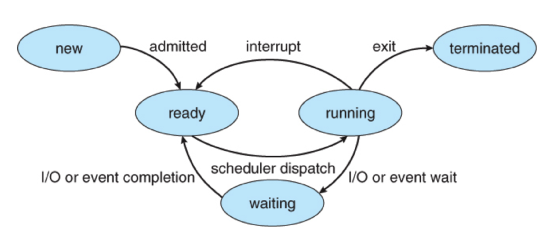

## 4. CPU 스케줄링
### 시분할 시스템
- 다중 사용자 지원을 위해 컴퓨터 응답 시간을 최소화 하는 시스템
- 여러 사용자들이 한 컴퓨터를 사용할 때 사용한다.
### 멀티 태스킹
- 단일 CPU에서, 여러 응용 프로그램이 동시에 실행되는 것처럼 보이게 하는 시스템.
- 10~20ms 단위로 실행 응용 프로그램이 바뀐다.
  

  
### 멀티 프로세싱
- 여러 CPU에 하나의 프로그램을 병렬로 실행해서 실행속도를 극대화시키는 시스템
  

  
  
### 멀티 프로그래밍
- 최대한 시간대비 CPU를 많이 활용하는 시스템.
---
### 프로세스란?
- 메모리에 올려져서 실행중인 프로그램을 뜻한다.
- 응용프로그램은 여러개의 프로세스의 상호작용으로 이루어져있다.
### 스케줄러란?
- 한정적인 메모리를 여러 프로세스가 효율적으로 사용할 수 있도록 다음 실행 시간에 실행할 수 있는 프로세스 중에 하나를 선택하는 역할을 한다.

### 스케줄링 알고리즘
1. <b>FIFO 스케줄러</b>
    - 먼저 들어온 프로세스를 먼저 실행한다.(배치 처리 시스템)
    - 큐 자료구조를 활용해서 구현할 수 있다.
    

2. <b>최단 작업 우선(SJF) 스케줄러</b>
    - 프로세스 실행시간이 짧은 프로세스 먼저 실행시킨다.
    

3. <b>우선순위 기반 스케줄러</b>
    - 정적 우선순위: 프로세스마다 우선순위를 미리 지정한다.
    - 동적 우선순위: 스케줄러가 상황에 따라 우선순위를 동적으로 변경한다.
    

4. <b>Round Robin 스케줄러</b>
    - 프로세스들 사이에 우선순위를 두지 않고, 순서대로 시간단위로 CPU를 할당하는 방식의 CPU 스케줄링 방법이다.
    - 자기 차례 이후에도 작업이 더 필요한 프로세스는 RoundRobin Queue에 들어가 다시 차례를 기다린다.
---
### 선점형 스케줄러 (Preemptive Scheduling)
- 하나의 프로세스가 다른 프로세스 대신에 CPU를 차지할 수 있다.
- 프로세스 running 중에 스케줄러가 이를 중단시키고 다른 프로세스로 바꿀 수 있다.
- ex) Round Robin
### 비선점형 스케줄러 (Non‑preemptive Scheduling)
- 하나의 프로세스가 끝나지 않으면 다른 프로세스는 CPU를 사용할 수 없다.
- 프로세스가 자발적으로 blocking 상태로 들어가거나 실행이 끝났을 때만 다른 프로세스로 바꿀 수 있다.
- ex) FIFO, SJF
### 프로세스 상태
   
- 비선점 스케줄링: **interrupt, scheduler dispatch**
- 선점 스케줄링: **I/O or event wait**

####프로세스의 상태 전이
- **승인 (Admitted)** : 프로세스 생성이 가능하여 승인된 상태

- **스케줄러 디스패치 (Scheduler Dispatch)** : 준비 상태에 있는 프로세스 중 하나를 선택하여 실행시키는 것.

- **인터럽트 (Interrupt)** : 예외, 입출력, 이벤트 등이 발생하여 현재 실행 중인 프로세스를 준비 상태로 바꾸고, 해당 작업을 먼저 처리하는 것.

- **입출력 또는 이벤트 대기 (I/O or Event wait)** : 실행 중인 프로세스가 입출력이나 이벤트를 처리해야 하는 경우, 입출력/이벤트가 모두 끝날 때까지 대기 상태로 만드는 것.

- **입출력 또는 이벤트 완료 (I/O or Event Completion)** : 입출력/이벤트가 끝난 프로세스를 준비 상태로 전환하여 스케줄러에 의해 선택될 수 있도록 만드는 것.
  
#### State Queue
- 여러 프로세스가 ready상태인 경우 관리를 위해 사용된다.
- 한 단위 시간에 많은 요청이 왔을 때, 이 요청들을 ready state queue에 넣는다.
- 이들 중 pop된 프로세스를 실행하면서, runnung state queue에 넣는다.
- 프로세스가 한 단위안에 끝나지 않은 경우 다시 ready state queue에 들어간다.
- running 도중, wait 상태에 들어간 프로세스는 block state queue로 이동된다.
- block state queue에 있던 프로세스는 해당 wait이 끝나면, 다시 ready queue로 들어간다.
- 중간중간 프로세스 완료나 block 상태로 CPU가 프로세스를 사용하고 있지 않은 상태를 **'idle 상태'** 라고한다.

---
###출처
- 프로세스의 상태전이 참고: https://github.com/gyoogle/tech-interview-for-developer/blob/master/Computer%20Science/Operating%20System/CPU%20Scheduling.md