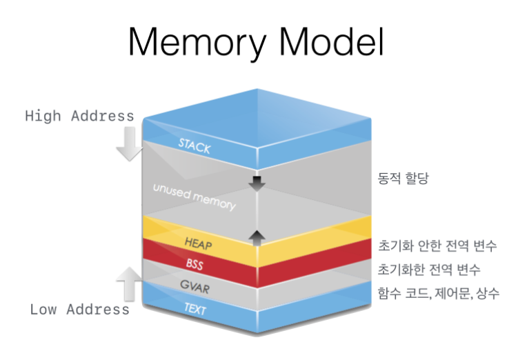
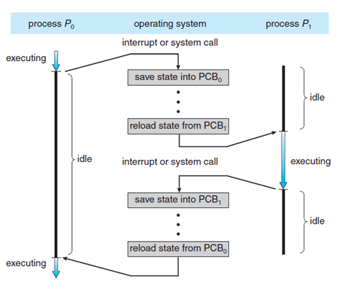

## 6. 프로세스
### 프로세스란?
- 실행중에 있는 프로그램을 의미한다. 
- 스케줄링의 대상이 되는 task와 같은 의미로 쓰인다.
- 프로세스는 최소 하나 이상의 쓰레드(thread)를 가지고 있으며, 실제로는 쓰레드 단위로 스케줄링을 한다.
### 프로세스 구조

- **Text(CODE)**
    - 컴파일된 소스 코드가 저장되는 영역
    - 읽기 전용 영역이기에 프로세스가 함부로 변경할 수 없다.
  

- **Data**
    - 전역 변수, 정적 변수(static), 초기화된 데이터가 저장되는 영역
    - 데이터 영역은 초기화 되지 않는 데이터를 저장하는 BSS 영역과 초기화된 데이터를 저장하는 Data(GVAR)영역으로 나뉜다.
    - 두 영역을 구분하는 이유는 초기화 되지 않은 데이터는 ram, 초기화 된 데이터는 rom에 저장하는데, 둘을 구분하지 않고 모두 rom에 저장하게되면 큰 사이즈의 rom이 필요하기 때문이다.
    - 프로그램의 시작과 함께 할당되며, 프로그램이 종료되면 소멸한다.
  

- **Stack**
    - 임시 데이터(지역 변수, 매개변수, 리턴 값 등)가 저장되는 영역
    - 함수 호출시 생성되며, 함수가 끝나면 반환된다.
  

- **Heap**
    - 필요에 의해 메모리를 동적으로 할당할 때 사용하는 메모리 영역(동적 메모리 영역)
    - C에서 malloc(), calloc()등의 함수를 사용하여 런타임에 사용자가 직접 메모리 크기를 할당할 수 있으며, 메모리 주소값에 의해서만 참조되고 사용되는 영역이다.
  
   
- Stack과 Heap영역은 같은 공간을 공유한다. Heap은 메모리의 낮은 주소부터, Stack은 높은 주소부터 할당된다. 그래서 각 영역이 상대 공간을 침범하는 일이 발생할 수 있는데, 이를 각각 **Stack Overflow, Heap Overflow**라고 한다.

### Process Control Block(PCB)이란?
  - 운영체제가 프로세스를 제어하기 위해 정보를 저장해 놓은 곳으로, 프로세스의 상태 정보를 저장하는 구조체이다.
  - 프로세스 상태 관리와 **Context Switching**을 위해 필요하다.
  - 프로세스 생성시 만들어지며 주기억장치에 유지된다.

### PCB에 포함되는 정보
1. **Process ID**: 프로세스를 구분하는 ID
2. **Process State**: 각 프로세스의 상태(생성, 준비, 대기, 실행, 완료)를 저장한다.
3. **Program Counter**: 다음 실행할 명령의 주소를 가리킨다.
4. **Register**: Accumulator, CPU Register, General Register 등이 포함된다.
5. **CPU Scheduling Information**: 우선 순위, 최종 실행시간, CPU 점유시간 등이 포함된다.
6. **Memory Information**: 해당 프로세스 주소공간 정보를 저장
7. **Process Information**: 페이지 테이블, 스케줄링 큐 포인터, 소유자, 부모 등
8. **Device I/O Status**: 프로세스에 할당된 입출력 장치 목록, 열린 파일 목록 등
9. **Pointer**: 부모/자식 프로세스에 대한 포인터, 자원에 대한 포인터 등
10. **Open File List**: 프로세스를 위해 열려있는 파일 리스트

### Context Switching

- 프로세스(P0)가 수행되던 중 인터럽트가 발생하면 현재 수행하고 있던 프로세스 정보를 PCB(0)에 저장한다.
- 수행하고 있던 프로세스(P0) 상태가 waiting이 된다면, CPU는 PCB(1)에 담긴 프로세스 정보를 불러와 프로세스(P1)를 running한다.
- 이렇게 수행중인 프로세스를 변경하는 과정에서 CPU 레지스터의 내용이 다음 실행할 프로세스의 정보로 변경되는 것을 **Context Switching**이라고 한다.
- Context Switching 때는 해당 CPU가 아무런 일을 하지 못하므로, 빈도가 잦아지면 **오버헤드**가 발생해 성능이 떨어진다.
---
### 출처
- 프로세스 구조: https://kyu9341.github.io/%EC%9A%B4%EC%98%81%EC%B2%B4%EC%A0%9C/2020/10/04/OS_Process_Structure/
- PCB: https://dev-mystory.tistory.com/119  