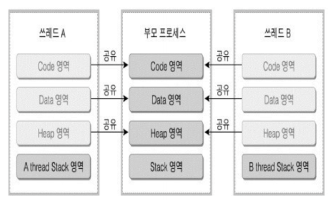
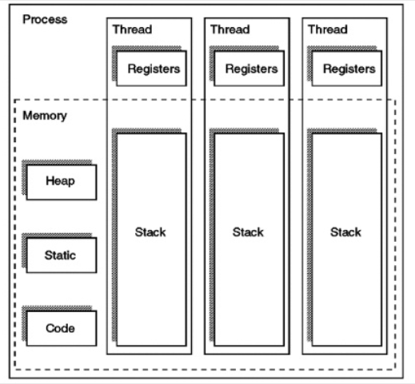
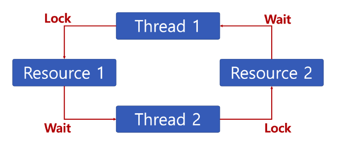

## 07.스레드
### 스레드(Thread)란?
- 프로세스 내에서 실행되는 흐름의 단위
- 일반적으로 한 프로그램은 하나 이상의 스레드를 가지고 있다.

### 스레드의 등장배경
- 멀티 프로세스 운영체제 기반 프로그램은 두 가지 이상의 일을 동시에 하려면 프로세스를 추가로 생성해야 한다.
- 그러나 이는 상당히 비효율적인데, 다수의 프로세스 생성은 빈번한 Context Switching 으로 이어져 성능 저하를 일으키기 때문이다.
- 이에 프로세스를 추가로 생성하지 않고 둘 이상의 실행 흐름을 가지며, 각각의 흐름들이 상태 정보를 서로 공유할 수 있게 만든 것이 스레드이다. 

### 스레드의 특성

1. 각각의 스레드는 프로세스의 메모리 공간 내에서 **각각 독립된 PC 레지스터와 스택**을 할당받는다.
2. 스레드는 프로세스의 **Code, Data, Heap 영역을 공유**한다.
3. Code 영역을 공유하기 때문에 한 프로세스 내부의 다른 스레드들은 **프로세스가 가지고 있는 함수를 호출할 수 있다**. 
4. Data, Heap 영역을 공유하기 때문에 **IPC(Inter Process Communication) 없이도 스레드 간 통신이 가능**하다.
5. 스레드는 프로세스처럼 스케줄링 대상이기 떄문에 Context Switching이 발생한다. 이 때 스레드는 공유하고 있는 메모리 영역이 있기 때문에, **서로 독립적인 프로세스에 비해 오버헤드가 작다**.

### 스택과 레지스터를 독립적으로 할당하는 이유?

- 스택 메모리 공간이 독립적이라는 것은 독립적인 함수 호출이 가능하다는 뜻이고, 이는 곧 **독립적인 실행 흐름을 만들 수 있다**는 뜻이다.
- 스레드는 스케줄러에 의해 CPU를 할당받았다 선점당하기를 반복하기 떄문에 명령어를 연속적으로 수행하지 못한다. 따라서 PC 레지스터를 독립적으로 할당하여 **스레드가 어느 부분까지 작업을 수행했는지 기억할 필요가 있다**.

### 스레드의 장단점
#### 장점
1. 응답시간이 줄어든다.
2. 자원 공유로 인해 시스템의 자원소모가 줄어든다.

#### 단점
1. 한 스레드만 문제가 생겨도 프로세스 전체에 영향을 미친다.
2. 스레드도 많이 생성하면 빈번한 Context Switching 으로 오버헤드가 날 수 있다.
3. 일부 자원을 공유하고 있기 때문에, 동기화 되지 않으면 충돌이 발생할 수 있다.
---
### 동기화 (Synchronization)란?
- 여러 개의 스레드가 같은 프로세스 내의 자원을 공유하는 경우 서로의 작업이 다른 작업에 영향을 줄 수 있다. 이를 방지하기 위해 스레드를 동기화 해주어야 한다.

### 동기화 방법 - 상호 배제(Mutual Exclusion)
- **임계 영역(Critical Section)**: 여러 스레드가 데이터를 공유하며 수행될 때, 각 스레드에서 공유 자원의 변경이 일어날 수 있는 부분.
1. **Mutex**
    - 임계 영역에 하나의 스레드만 들어갈 수 있으며, 들어갈 때 lock을 걸어 다른 스레드의 접근을 막는다.
    - lock을 획득한 스레드가 반드시 unlock해야하며, 이 때 lock을 반환한다.
    - 동기화 대상이 하나일 때 사용한다.
2. **Semaphore**
    - 임계 영역에 여러개의 스레드가 들어갈 수 있다.
    - 현재 수행중인 스레드가 아닌 다른 스레드가 Semaphore를 해제할 수 있다.
    - 동기화 대상이 여럿일 때 사용한다.
---
### 교착상태(Deadlock)란?

- 두 개 이상의 작업이 서로 상대방의 작업이 끝나기 만을 기다리고 있어 다음 단계로 진행하지 못하는 상태

### 교착상태 발생 조건
- 다음 네 가지 조건이 모두 성립될 때, 교착 상태가 발생할 수 있다.
1. 상호배제(Mutual exclusion): 한 번에 프로세스 하나만 해당 자원을 사용할 수 있다. (배타적 통제권)
2. 점유대기(Hold and wait): 프로세스가 할당된 자원을 가진 상태에서 다른 자원을 기다린다.
3. 비선점(No preemption): 프로세스가 어떤 자원의 사용을 끝낼 때까지 그 자원을 뺏을 수 없다.
4. 순환대기(Circular wait): 각 프로세스는 순환적으로 다음 프로세스가 요구하는 자원을 가지고 있다.

### 교착상태 해결법
1. 예방(Prevention)
   - 다음 네가지 조건 중 하나를 제거한다.
     1. 상호배제 조건의 제거: 한 번에 여러 프로세스가 해당 자원을 사용할 수 있게 한다. (후에 동기화 문제가 발생할 수 있다.)
     2. 점유와 대기 조건의 제거: 한번에 모든 필요 자원 점유 및 해제
     3. 비선점 조건 제거: 높은 우선 순위의 프로세스가 해당 자원을 선점할 수 있도록 한다.
     4. 순환 대기 조건 제거: 자원을 한 방향으로만 요구할 수 있게 한다.
   - 이러한 예방 방법은 시스템의 처리량이나 효율성을 떨어뜨릴 수 있다.

2. 회피(Avoidance) - **은행원 알고리즘(Banker's Algorithm)**
   - 프로세스가 자원을 요구할 때 시스템은 자원을 할당한 후에도 안정 상태로 남아있게 되는지를 사전에 검사하여 교착 상태를 회피하는 기법
   - 안정 상태에 있으면 자원을 할당하고, 그렇지 않으면 다른 프로세스들이 자원을 해지할 때까지 대기한다.

3. 발견 및 회복(Detection and Recovery)
   - 발견: 교착상태가 발생했는지 점검하여 교착 상태에 있는 프로세스와 자원을 발견하는 것
   - 회복: 교착 상태를 일으킨 프로세스를 종료하거나, 교착상태의 프로세스에 할당된 자원을 선점하여 프로세스나 자원을 회복하는 것

### 기아상태(Starvation)란?
- 특정 프로세스의 우선순위가 낮아서 원하는 자원을 계속 할당 받지 못하는 상태

### 기아상태 해결법 - 우선 순위 변경
- 프로세스 우선순위를 수시로 변경해서, 각 프로세스가 높은 우선순위를 가질 기회를 준다.
- 오래 기다린 프로세스의 우선순위를 높여준다.
- 우선 순위가 아닌, 요청 순서대로 처리하는 FIFO 기반 요청큐를 사용한다.
---
### 출처
- 스택과 레지스터를 독립적으로 할당하는 이유: https://velog.io/@jacob0122/%ED%94%84%EB%A1%9C%EC%84%B8%EC%8A%A4-%EC%8A%A4%EB%A0%88%EB%93%9C