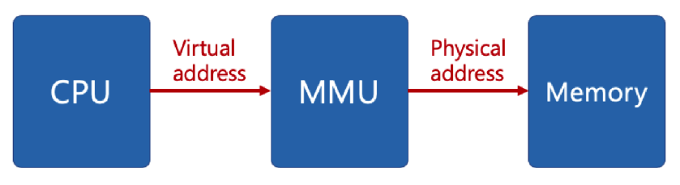
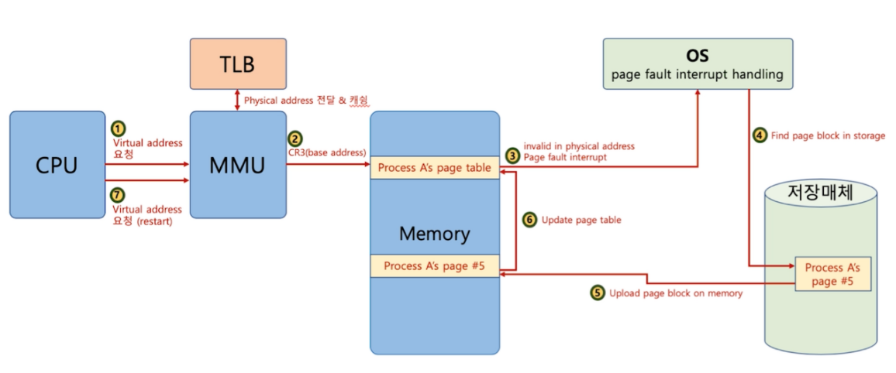
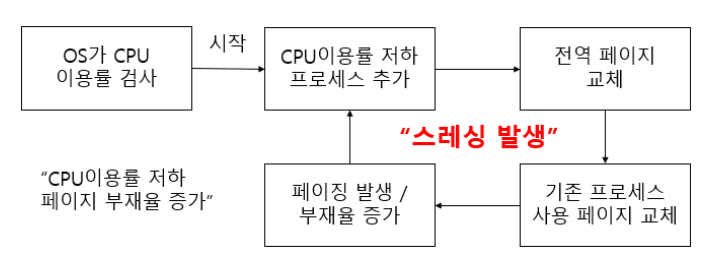

## 8. 가상 메모리
### 가상 메모리(Virtual Memory)란?
- 주기억장치의 부족한 물리적 저장공간을 보조기억장치를 이용해서 가상으로 늘려 주는 기술

### 가상 메모리가 필요한 이유?
- 사용자가 기억장소를 일일히 할당하는 불편을 없애준다.
- 프로세스의 크기가 실제 메모리의 용량을 초과해도 실행될 수 있다.
- 프로세스간 공간 분리로 프로세스 이슈가 전체 시스템에 영향을 주지 않는다.

### 가상 메모리의 원리

- CPU가 가상 메모리의 가상 주소(프로세스가 참조하는 주소)에 접근한다.
- MMU(Memory Management Unit) 하드웨어 장치가 가상 주소를 물리 주소(실제 메모리 주소)로 바꿔준다.
- 물리 주소를 통해 물리 메모리로 접근할 수 있게 된다.
---
### 페이징(Paging) 이란?

### 요구 페이징(Demand Paging)
- 프로세스의 모든 데이터를 메모리로 적재하지 않고, 실행 중 필요한 시점에 메모리로 적재하는 전략
- 더 이상 필요하지 않은 페이지 프레임은 다시 저장 매체에 교체 알고리즘을 통해 저장된다.

### 페이지 폴트(Page Fault)

- 어떤 페이지가 가상 메모리에는 존재하지만 물리 메모리에 없을 때 발생하는 인터럽트
- Page Fault가 일어나면, 해당 페이지를 가지고 있는 프로세스에 접근하여 해당 페이지를 물리 메모리에 적재한다. 그리고 적재된 페이지에 대한 정보를 Page Table에 업데이트한다.
- 페이지 폴트가 자주 일어난다면 처리하는데 많은 시간이 소요될 것이다.

### 스래싱(Thrashing)

- 빈번한 페이지 폴트로 페이지 교체시간이 프로세스의 동작 시간보다 길어지는 경우 스래싱이라고 한다.
- 스래싱을 근본적으로 줄이기 위해서는 다중 프로그래밍 정도를 낮추어야 한다.
---
### 페이지 교체 알고리즘
- Page Fault 상황에서 운영체제가 하드 디스크에서 페이지를 찾아 물리 메모리에 올리려 하는데, 물리 메모리가 다 차있는 경우가 있다.
- 그렇다면 기존 페이지 중 하나를 물리 메모리에서 저장 매체로 내리고, 새로운 페이지를 해당 물리 메모리 공간에 올려야 할 것이다.
- 이 때 어떤 페이지를 물리 메모리에서 저장 매체로 내릴 것인지 결정하는 방법이 페이지 교체 알고리즘이다.

1. FIFO(First In First Out)
   - 가장 먼저 들어온 페이지를 교체
2. OPT(Optimal Replacement)
   - 가장 오랫동안 사용하지 않을 페이지를 교체
3. LRU(Least Recently Used)
   - 가장 오래 전에 사용된 페이지를 교체
4. LFU(Least Frequently Used)
   - 가장 적게 사용된 페이지를 교체
5. NUR(Not Used Recently)
   - 최근에 사용하지 않은 페이지부터 교체