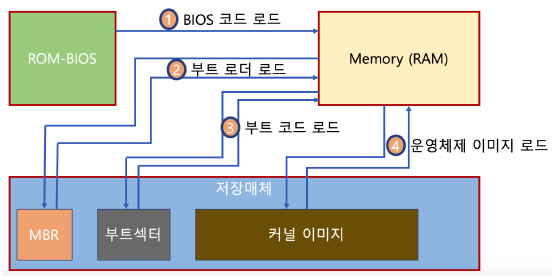

## 10. 부팅
### 부팅이란?
- 컴퓨터가 켜졌을 때 초기 설정과 운영체제를 메모리로 불러들여 작동을 준비하는 작업
### 부팅 과정

1. PC의 전원이 켜지면 ROM에 들어있는 BIOS가 로드된다. BIOS는 컴퓨터에 연결된 저장 매체에서 설정된 순서대로 부트 로더들을 불러 온다.
2. 부트로더는 저장 매체에서 부팅이 가능한 파티션 정보를 불러오는 역할을 한다. 이는 첫 섹터 속 MBR(Master Boot Record)에 저장되어있다. MBR 섹터의 마지막 2바이트는 정상적인 MBR을 알려주는 0x55AA값을 가지는데, 이는 '이 디스크에 부트에 필요한 프로그램이 있다'는 것을 의미한다.
3. 파티션이 부팅이 가능하다면, 부트로더는 해당 파티션의 VBR(Volume Boot Record)을 읽어 커널 이미지를 메모리에 올리면서 운영체제에서 정의된 부팅 과정을 수행한다. 
